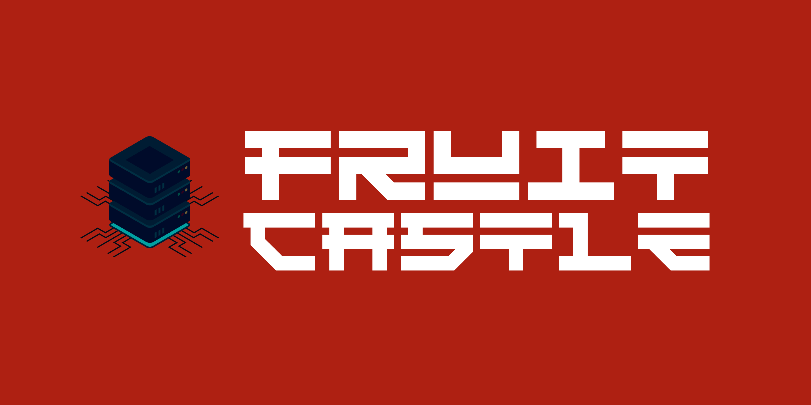

# FruitCastle 🍎🏰

**FruitCastle** is a web application built with Flask and Python intended to act as a common backend service for hosting data that is wiil be used by various cross-platform and web applications.


## View deployed app  🚀🎉🎊

[https://fruitcastle.herokuapp.com/](https://fruitcastle.herokuapp.com/ "Common Backend Service for hosting API and data")

<br>
<p align="center">

</p>

## Installation Guidelines

Clone the repo to your computer, execute to the following commands in CMD or Bash:

```bash
git clone https://github.com/brownboycodes/FruitCastle.git
```

access the downloaded directory 📁:

```bash
cd FruitCastle
```

setup virtual environment for Python 🐍:

```bash
py -3 -m venv venv
```

activate virtual environment:

```bash
venv\Scripts\activate 
```

install packages 📦 required by the flask app 🐍:

```bash
pip install -r requirements.txt 
```

To test the server in `dev mode` 👨‍💻, create a file, for example- `run_dev_mode.py` and paste the following code 🐍:

```python
from src.fruit_castle.main import app, socketio
from src.fruit_castle.hadwin.v3.v3_socket_events import *


if __name__ == "__main__":
    app.config.update(
        TESTING=True,
        ENV='development',
    )
    if app.config['ENV'] == 'development':
        from dotenv import load_dotenv
        load_dotenv()
    app.config['SECRET_KEY'] = os.environ['SECRET_KEY']

    socketio.run(app, host="0.0.0.0", port=5000, debug=True)
```

🎉 Now, start the server in `development mode` 🚀:

```bash
py run_dev_mode.py
```

<br>

---

> [FruitCastle](https://fruitcastle.herokuapp.com/) © 2022 was developed by Nabhodipta Garai and is owned by him.
